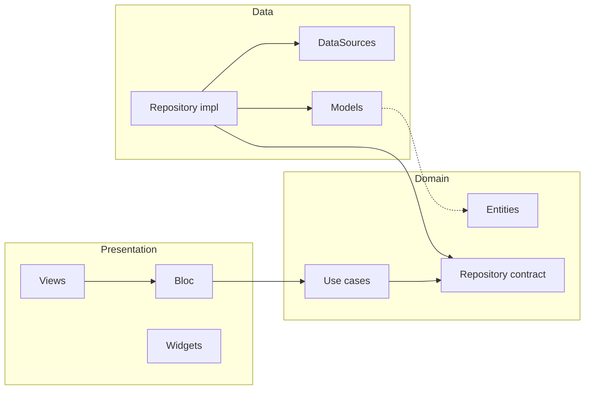

# Estructura del proyecto Flutter

El proyecto sigue **feature-first** y **Clean Architecture**: cada funcionalidad vive en su propia feature y se organiza en capas claras.

## Árbol de `lib/`

```
lib/
├── main.dart
├── app.dart
├── router.dart
├── injection.dart
├── core/
│   ├── constants/       # api_constants, etc.
│   ├── errors/          # result.dart, failures.dart
│   ├── network/         # api_client, interceptors
│   └── theme/           # app_theme
└── features/
    └── <feature>/       # auth, home, products, ...
        ├── data/
        │   ├── datasources/   # contrato + *_impl
        │   ├── models/
        │   └── repositories/ # *_impl
        ├── domain/
        │   ├── entities/
        │   ├── repositories/  # contratos (abstract)
        │   └── usecases/
        └── presentation/
            ├── bloc/         # event, state, bloc
            ├── views/
            └── widgets/
```

## Capas por feature

| Capa | Responsabilidad |
|------|-----------------|
| **data** | Fuentes de datos (remoto/local), modelos DTO, implementación del repositorio. Convierte modelos en entidades. |
| **domain** | Entidades puras, contratos de repositorio, casos de uso. Sin dependencias de Flutter ni de infraestructura. |
| **presentation** | BLoC/Cubit (eventos y estados), pantallas (views), widgets reutilizables de la feature. |

## Regla de dependencias

- **Domain** no depende de `data` ni de `presentation`.
- **Data** y **presentation** dependen de `domain` (entidades, contratos de repositorio).
- **Data** no depende de `presentation`.
- **Presentation** puede usar casos de uso inyectados y entidades.



## Inyección de dependencias

- Se usa **GetIt** en `injection.dart`.
- Orden de registro recomendado:
  1. Core (Dio, clientes, etc.)
  2. Por feature: DataSources → Repository → Use cases → BLoC/Cubit
- Usar `registerLazySingleton` para servicios y repositorios, y para BLoCs que deban vivir durante toda la sesión (por ejemplo, para redirección en el router).

## Convenciones de nombres

- **DataSources**: `<feature>_remote_datasource.dart` / `*_local_datasource.dart`; interfaz sin sufijo, implementación con `_impl`.
- **Repositories**: contrato en `domain/repositories/<feature>_repository.dart`; implementación en `data/repositories/<feature>_repository_impl.dart`.
- **Use cases**: verbo + entidad/objeto, por ejemplo `get_session_usecase.dart`, `login_usecase.dart`.
- **BLoC**: `<feature>_bloc.dart`, `<feature>_event.dart`, `<feature>_state.dart`.
- **Views**: `<pantalla>_view.dart`. Widgets de la feature en `widgets/` con nombre descriptivo.

Cuando añadas una nueva feature, replica esta estructura dentro de `lib/features/<nombre_feature>/`.
