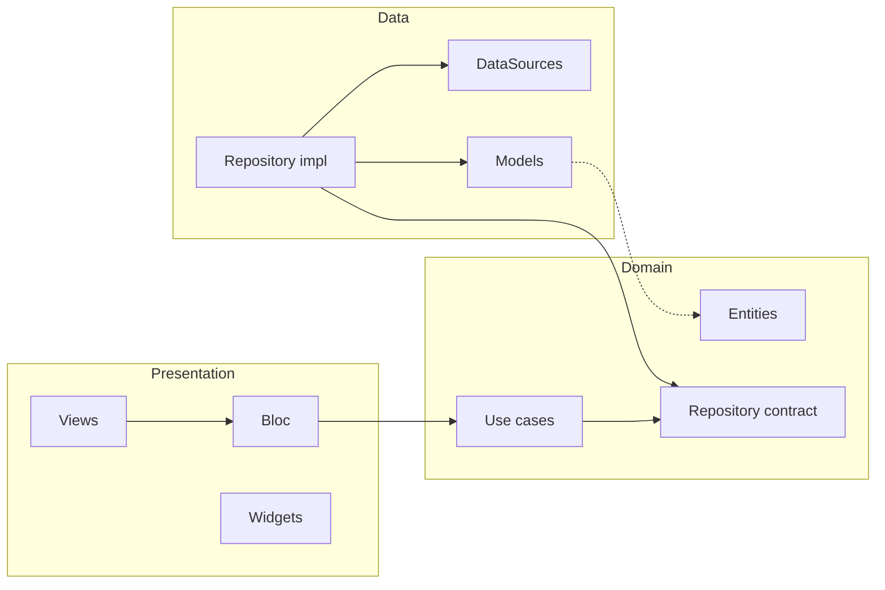

# Flutter Master – Agente de buenas prácticas

Documento único de referencia para la estructura, código limpio y rendimiento del proyecto Flutter. Mantén **clean architecture**, **feature-first** y **código limpio** en todo el código.

---

## Resumen rápido

- **Feature-first**: cada funcionalidad vive en `lib/features/<feature>/`.
- **Clean Architecture**: capas `data` → `domain` → `presentation` dentro de cada feature.
- **Inyección**: `GetIt` en `injection.dart`; registrar datasources, repositories, use cases y BLoCs.
- **Estado**: BLoC/Cubit para lógica de presentación; eventos y estados inmutables.
- **Resultado/errores**: `Result<T, Failure>` en dominio; no propagar excepciones crudas a la UI.
- **DRY**: no código repetido; extraer widgets y lógica reutilizable.
- **Never nest**: máximo 2–3 niveles de anidación; early return y widgets extraídos.
- **Nombrado**: variables/funciones/clases bien nombradas (camelCase, PascalCase, descriptivos).
- **Widgets en vez de helpers**: usar clases que extiendan `StatelessWidget` para UI reutilizable, no funciones que devuelvan `Widget`.
- **Const**: usar `const` en widgets y literales que no dependan de estado.
- **Rendimiento**: listas lazy, buildWhen/BlocSelector, keys cuando haga falta.

Cuando añadas o modifiques código, sigue esta guía.

---

# 1. Estructura del proyecto

El proyecto sigue **feature-first** y **Clean Architecture**: cada funcionalidad vive en su propia feature y se organiza en capas claras.

## 1.1 Árbol de `lib/`

```
lib/
├── main.dart
├── app.dart
├── router.dart
├── injection.dart
├── core/
│   ├── constants/       # api_constants, etc.
│   ├── errors/          # result.dart, failures.dart
│   ├── network/         # api_client, interceptors
│   └── theme/           # app_theme
└── features/
    └── <feature>/       # auth, home, products, ...
        ├── data/
        │   ├── datasources/   # contrato + *_impl
        │   ├── models/
        │   └── repositories/ # *_impl
        ├── domain/
        │   ├── entities/
        │   ├── repositories/  # contratos (abstract)
        │   └── usecases/
        └── presentation/
            ├── bloc/         # event, state, bloc
            ├── views/
            └── widgets/
```

## 1.2 Capas por feature

| Capa | Responsabilidad |
|------|-----------------|
| **data** | Fuentes de datos (remoto/local), modelos DTO, implementación del repositorio. Convierte modelos en entidades. |
| **domain** | Entidades puras, contratos de repositorio, casos de uso. Sin dependencias de Flutter ni de infraestructura. |
| **presentation** | BLoC/Cubit (eventos y estados), pantallas (views), widgets reutilizables de la feature. |

## 1.3 Regla de dependencias

- **Domain** no depende de `data` ni de `presentation`.
- **Data** y **presentation** dependen de `domain` (entidades, contratos de repositorio).
- **Data** no depende de `presentation`.
- **Presentation** puede usar casos de uso inyectados y entidades.



## 1.4 Inyección de dependencias

- Se usa **GetIt** en `injection.dart`.
- Orden de registro recomendado:
  1. Core (Dio, clientes, etc.)
  2. Por feature: DataSources → Repository → Use cases → BLoC/Cubit
- Usar `registerLazySingleton` para servicios y repositorios, y para BLoCs que deban vivir durante toda la sesión (por ejemplo, para redirección en el router).

## 1.5 Convenciones de nombres (estructura)

- **DataSources**: `<feature>_remote_datasource.dart` / `*_local_datasource.dart`; interfaz sin sufijo, implementación con `_impl`.
- **Repositories**: contrato en `domain/repositories/<feature>_repository.dart`; implementación en `data/repositories/<feature>_repository_impl.dart`.
- **Use cases**: verbo + entidad/objeto, por ejemplo `get_session_usecase.dart`, `login_usecase.dart`.
- **BLoC**: `<feature>_bloc.dart`, `<feature>_event.dart`, `<feature>_state.dart`.
- **Views**: `<pantalla>_view.dart`. Widgets de la feature en `widgets/` con nombre descriptivo.

Cuando añadas una nueva feature, replica esta estructura dentro de `lib/features/<nombre_feature>/`.

---

# 2. Código limpio

Principios aplicados al proyecto: DRY, never nest, nombrado claro, funciones y widgets acotados.

## 2.1 DRY (Don't Repeat Yourself)

- No copies y pegues bloques de código. Si la misma lógica o el mismo fragmento de UI aparece en varios sitios, extrae:
  - **UI**: un widget con nombre descriptivo (clase que extiende `StatelessWidget` o `Widget`), no una función que devuelve `Widget` (ver sección 3.1).
  - **Lógica**: un método privado, una función en un archivo de utilidades dentro de la feature, o en `core/` si es transversal.
- Ejemplo de extracción de lógica repetida:

```dart
// Malo: misma validación repetida
if (email.isEmpty || !email.contains('@')) { ... }
// en otro archivo
if (email.isEmpty || !email.contains('@')) { ... }

// Bueno: una función reutilizable
bool isValidEmail(String email) =>
    email.isNotEmpty && email.contains('@');
```

## 2.2 Never nest

- Mantén como máximo 2–3 niveles de anidación. Si hay más, extrae a método privado o a un widget con nombre que describa la responsabilidad.
- Usa **early return** o **guard clauses**: salir pronto cuando no se cumplan condiciones, para reducir indentación.

```dart
// Malo: anidación profunda
Widget build(BuildContext context) {
  return BlocBuilder<AuthBloc, AuthState>(
    builder: (context, state) {
      if (state is AuthAuthenticated) {
        return Scaffold(
          body: state.session.accessibleBranches.isEmpty
              ? const EmptyBranchesMessage()
              : ListView.builder(
                  itemCount: state.session.accessibleBranches.length,
                  itemBuilder: (context, index) {
                    final branch = state.session.accessibleBranches[index];
                    return ListTile(
                      title: Text(branch.name),
                      onTap: () => _selectBranch(context, branch.id),
                    );
                  },
                ),
        );
      }
      return const SizedBox.shrink();
    },
  );
}

// Bueno: early return y widgets extraídos
Widget build(BuildContext context) {
  return BlocBuilder<AuthBloc, AuthState>(
    builder: (context, state) {
      if (state is! AuthAuthenticated) {
        return const SizedBox.shrink();
      }
      final branches = state.session.accessibleBranches;
      if (branches.isEmpty) {
        return const Scaffold(body: EmptyBranchesMessage());
      }
      return _BranchList(
        branches: branches,
        onSelectBranch: (id) => _selectBranch(context, id),
      );
    },
  );
}
```

## 2.3 Nombrado

- **Variables y parámetros**: `camelCase`, descriptivos. Evitar abreviaturas no obvias (`usr` → `user`, `btn` → `button` cuando no sea evidente).
- **Funciones y métodos**: verbo o pregunta clara: `getSession()`, `isValid()`, `saveUser()`, `hasAccess()`.
- **Clases y widgets**: `PascalCase`: `AuthBloc`, `LoginForm`, `ProductListItem`.
- **Constantes**: `lowerCamelCase` o `SCREAMING_SNAKE_CASE` según la convención del proyecto (en Dart suele usarse `lowerCamelCase` para const).
- **Archivos**: snake_case, coherentes con el contenido: `auth_repository.dart`, `login_view.dart`, `product_form_widget.dart`.

```dart
// Malo
final d = DateTime.now();
bool chk(String s) => s.length > 5;
class ProdList extends StatelessWidget { ... }

// Bueno
final now = DateTime.now();
bool hasMinLength(String text) => text.length > 5;
class ProductListWidget extends StatelessWidget { ... }
```

## 2.4 Tamaño y responsabilidad única

- Funciones y métodos: cortos; si un método hace varias cosas, dividir o extraer.
- Widgets: una responsabilidad clara; si `build` es muy largo, extraer subwidgets con nombre.
- Archivos: si un archivo crece mucho (p. ej. > 200–300 líneas), valorar dividir por responsabilidad (p. ej. varios widgets en archivos separados dentro de `widgets/`).

## 2.5 Const

- Usa `const` en constructores de widgets y en literales que no dependan de estado cuando sea posible. Reduce rebuilts y ayuda al rendimiento. Detalle en la sección 3.2.

---

# 3. Rendimiento

Reglas accionables para mantener un buen rendimiento en la UI y en el árbol de widgets.

## 3.1 Widgets en lugar de funciones que devuelven Widget

Las funciones que devuelven `Widget` no crean un `Element` estable en el árbol: Flutter no puede optimizar reutilizando elementos ni puede hacer const. Cualquier pieza de UI reutilizable debe ser una **clase** que extienda `StatelessWidget` (o `Widget` con `Element` propio).

```dart
// Malo: función que devuelve Widget
Widget _buildHeader(String title) {
  return Padding(
    padding: const EdgeInsets.all(16),
    child: Text(title, style: Theme.of(context).textTheme.titleLarge),
  );
}

// Bueno: widget dedicado
class _PageHeader extends StatelessWidget {
  const _PageHeader({required this.title});
  final String title;

  @override
  Widget build(BuildContext context) {
    return Padding(
      padding: const EdgeInsets.all(16),
      child: Text(title, style: Theme.of(context).textTheme.titleLarge),
    );
  }
}
```

Ventajas del widget: puede ser `const` cuando sus argumentos son constantes, participa correctamente en el árbol de elementos y solo se reconstruye cuando cambian sus parámetros.

## 3.2 Uso de const

- Usa el constructor `const` en todos los widgets que no dependan de datos variables (textos fijos, iconos, padding, etc.).
- Construye listas y mapas constantes con `const []` o `const {}` cuando el contenido sea constante.
- El compilador puede reutilizar la misma instancia y Flutter evita rebuilds innecesarios en hijos const.

```dart
// Malo: sin const, se recrea en cada rebuild
return Padding(
  padding: const EdgeInsets.all(16),
  child: Text('Título'),
);

// Bueno: widget const cuando no depende de datos variables
return const Padding(
  padding: EdgeInsets.all(16),
  child: Text('Título'),
);
```

En listas de hijos, marca como `const` los widgets que no dependan de datos dinámicos:

```dart
children: [
  const SizedBox(height: 16),
  const Divider(),
  Text(user.name), // no const: depende de user
],
```

## 3.3 Evitar rebuilds innecesarios

- **Extraer widgets**: si solo una parte de la pantalla depende del estado (p. ej. del BLoC), extrae esa parte a un widget hijo. Así solo ese hijo se reconstruye cuando cambia el estado.
- **BlocBuilder**: usa `buildWhen` para no reconstruir cuando el estado no afecta a la UI que estás mostrando.

```dart
BlocBuilder<AuthBloc, AuthState>(
  buildWhen: (previous, current) =>
      previous.runtimeType != current.runtimeType,
  builder: (context, state) { ... },
)
```

- **BlocSelector**: cuando solo necesites un campo del estado, usa `BlocSelector` para que el builder solo se ejecute cuando ese campo cambie.

## 3.4 Listas largas

- Usa **ListView.builder**, **GridView.builder** o **CustomScrollView** con slivers lazy en lugar de crear todos los hijos de una vez (evita `ListView(children: items.map(...).toList())` con listas grandes).
- Así solo se construyen los elementos visibles (y un pequeño margen).

```dart
// Malo para muchas items
ListView(children: items.map((e) => ItemTile(e)).toList())

// Bueno
ListView.builder(
  itemCount: items.length,
  itemBuilder: (context, index) => ItemTile(items[index]),
)
```

## 3.5 Keys

- Usa `Key` cuando Flutter pueda confundir la identidad de un widget entre frames: listas dinámicas con reordenación, inserción o borrado, o cuando necesites preservar estado (p. ej. formularios dentro de un PageView).
- No abuses: solo cuando haya problemas visibles de estado incorrecto o rendimiento. Preferir `ValueKey` con un id estable (p. ej. `ValueKey(item.id)`).

---

**Resumen**: preferir **widgets** a funciones que devuelven Widget, usar **const** siempre que se pueda, **extraer widgets** y **buildWhen/BlocSelector** para limitar rebuilds, y **listas lazy** para listas largas.
